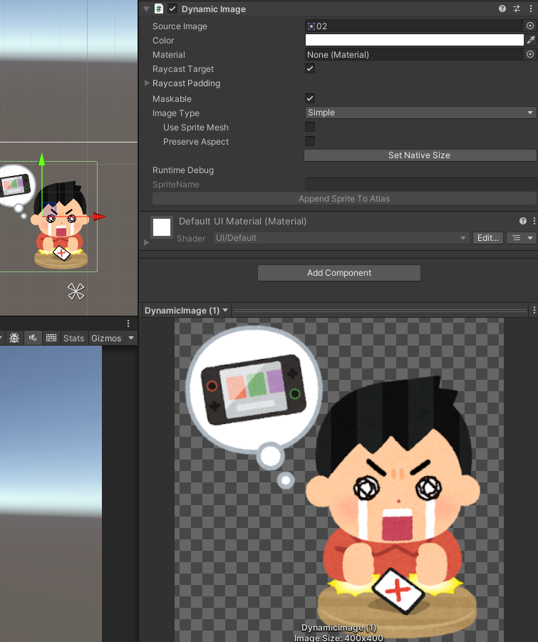

[English README](./README.md)

# Unity-DynamicAtlas

Unity动态图集解决方案

其中矩形打包算法基于[GitHub - villekoskelaorg/RectanglePacking: Super fast AS3 implementation of rectangle packing algorithm](https://github.com/villekoskelaorg/RectanglePacking.git) 做了些许扩展，在此鸣谢@[villekoskelaorg (Ville Koskela) · GitHub](https://github.com/villekoskelaorg)

## 实现的特性

- 图集压缩纹理

- 异步加载资源

- 图集内部引用计数，自动释放引用为0的区域

- 大图自动Fallback为散图引用，可自定义触发阈值

- 支持传入自定义资源加载方法

## 使用限制

- 不支持OpenGL ES2.0

- 散图和图集的纹理压缩格式必须一致

- 散图不能为静态图集成员 

## 使用示例

可以通过Demo场景中的`Init.cs`脚本来快速获取参考。

1. 在外部代码中调用初始化方法DynamicAtlasManager.Init，以初始化动态图集所需的各类参数。推荐在您的初始化逻辑中调用，例如Awake()

2. 使用`DynamicImage`组件代替`UnityEngine.UI.Image`组件。可以直接静态挂载图片，也可以通过`DynamicImage.SetDynamicSprite(string spriteName)`方法动态加载图片。
   
   

3. Enjoy！
