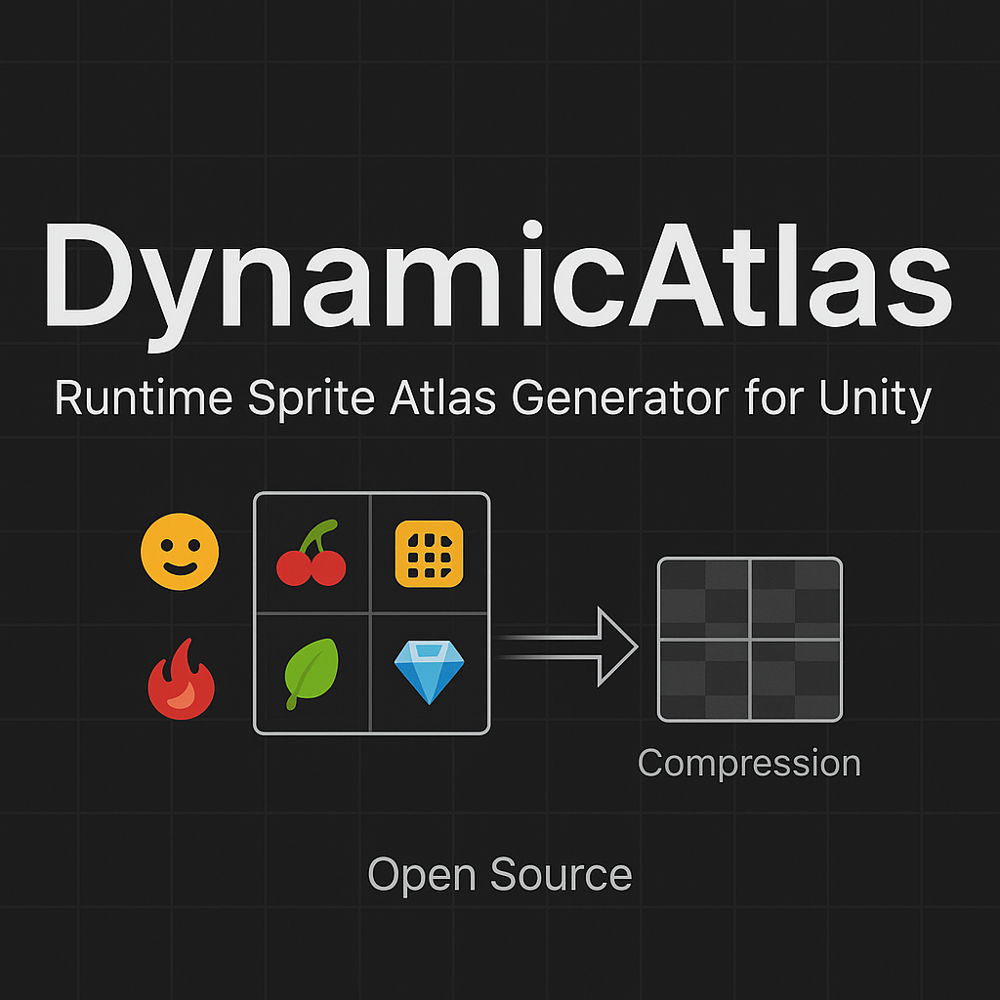

[中文版 README](./README.cn.md)

# Unity-DynamicAtlas

A dynamic atlas solution for Unity.

The rectangle packing algorithm is based on [GitHub - villekoskelaorg/RectanglePacking: Super fast AS3 implementation of rectangle packing algorithm](https://github.com/villekoskelaorg/RectanglePacking.git) with some extensions. Special thanks to @[villekoskelaorg (Ville Koskela) · GitHub](https://github.com/villekoskelaorg).

## Features

- Atlas texture compression
- Asynchronous resource loading
- Internal reference counting for atlas, automatically releases regions with zero references
- Large images automatically fallback to loose texture reference, with customizable threshold
- Supports custom resource loading methods

## Limitations

- OpenGL ES2.0 is not supported
- The texture compression format of loose textures and atlases must be consistent
- Loose textures cannot be static atlas members 